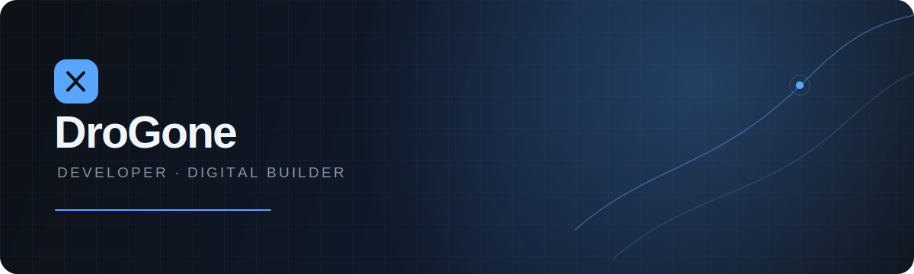

  

 

  
  

## Bonjour, moi c'est DroGone 👋

Je construis des expériences numériques soignées, avec une attention particulière portée à l'interface, aux détails et à la qualité de l'expérience utilisateur.

| Ce que j'aime construire | Ma manière de travailler | Mon objectif |
| :--- | :--- | :--- |
| Applications web, interfaces et expériences interactives | Itérer rapidement, garder le code lisible et soigner les finitions | Donner vie à des produits simples, utiles et agréables à utiliser |

## Technologies

  

## Activité

  
  

 

  Construire avec intention. Améliorer en continu.

