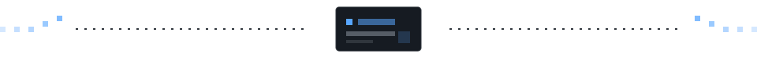

  

 

  

  <b>INTERFACE CRAFT</b> &nbsp;·&nbsp; <b>WEB EXPERIENCES</b> &nbsp;·&nbsp; <b>CREATIVE DEVELOPMENT</b>

 

  

## ✦ Profile

I build polished digital experiences where design, motion and implementation work together. My focus is simple: clear interfaces, thoughtful interaction, and the small details that make a product feel finished.

<table>
  <tr>
    <td width="33%" valign="top"><b>01 — Interface</b> Structured, responsive UI with visual clarity at every screen size.</td>
    <td width="33%" valign="top"><b>02 — Interaction</b> Motion and feedback that support the experience, never distract from it.</td>
    <td width="33%" valign="top"><b>03 — Craft</b> Clean implementation, intentional details and room to evolve.</td>
  </tr>
</table>

## ✦ Toolkit

<b>Frontend & UI</b>

  
  
  
  
  

<b>Code & creative tooling</b>

  
  
  
  
  

## ✦ GitHub activity

  
  

 

  
    
  Build with intent. Refine with care.

